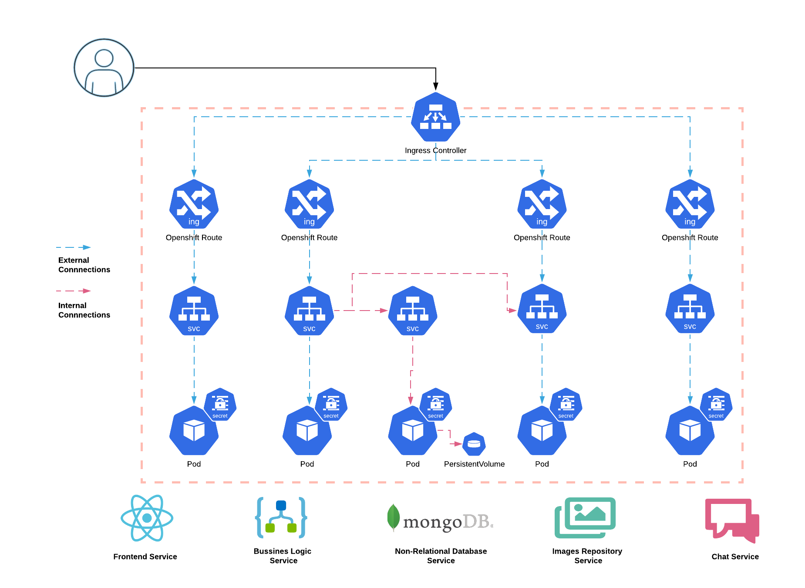

# Linking App

Linking App is an experimental dating application created from an education or training point of view. The main objective of this project was to have a source of use cases in order to generate many JavaScript implementation scenarios.

Currently, Linking App project is composed of multiple microservices, or JavaScript projects, which are working together using an API-based integration. This integration model provides a flexible and stable application network which is key in order to be abel to scale the application and add extra on-demand features. Thanks to this microservices organization, it is possible to scale horizontally the most part of the services providing other cloud-native application feature, "grow on demand".

On the other hand, The use cases reach JavaScript Frontend technologies, JavaScript Backend technologies, No-SQL database implementation or even JavaScript secure login and session management scenarios. This is an "complex" scenario and the following table displays a set of the most important technologies which has been involved in this project:

-   NodeJS
-   Javascript
-   Typescript
-   React
-   Socket.io
-   Passport (JWT -> JSON Web Tokens)
-   MongoDB

It is important to bear in mind that Linking App application has a cloud-native philosophy. For these reason, it is possible to find multiple Openshift or Kubernetes references along this or specific microservices documentation. Please, visit the following links for more information about Cloud technologies: [Understanding cloud-native applications](https://www.redhat.com/en/topics/cloud-native-apps), [Kubernetes](https://kubernetes.io/) or [Openshift](https://www.openshift.com/).

Lastly, This repository tries to collect information about Linking App application architecture and the Continuous Integration and Deployment (CI/CD) methodology implemented in this microservices-based application. In the following sections, It it possible to find information about different topics in order to answer the following questions:

-   How was Linking App designed?
-   How do Linking App microservices talk to each other?
-   How is the current Linking App architecture?
-   How Can I deploy each microservice in Openshift (kubernetes)?
-   Which are CI/CD pieces implicated in this project?
-   How Can I deploy CI/CD environment in Openshift (kubernetes)?

Please, continue reading the following sections.

## Linking App Microservices

As mentioned before, Linking App is composed of multiple JavaScript-based microservices. Each microservice has an independent GitHub repository in order to be able to explore and manage it individually.

Currently, Linking App project involves the following microservices:

-   [Front](https://github.com/acidonper/linking-app-front.git) -> _Linking App Front_ is a React project, written in Typescript, which provides a new way of meet people to the users though an amazing Web Interface.
-   [Back](https://github.com/acidonper/linking-app-back.git) -> _Linking App Back_ is a NodeJS project which provides an API in order to allow _Linking App Front_ users access to some Linking App information and implements the matching algorithm.
-   [Images](https://github.com/acidonper/linking-app-images.git) -> _Linking App Images_ is a NodeJS project which provides an API in order to allow _Linking App Front_ users manage their pictures and serves them though a web server.
-   [Chat](https://github.com/acidonper/linking-app-chat.git) -> _Linking App Chat_ is a NodeJS project which provides a Chat tool in order to allow _Linking App Front_ users a way of communication to each other.

As it is possible to see in each microservice repository, some application deployment documentation has been included in order to facilitate the microservice deployment in Openshift though Openshift templates. It is important to bear in mind that this procedure are located in a folder name `.openshift` in each microservice repository. **It is important to bear in mind that this deployment method is not exclude local deployment or test using nodejs commands.**

On the other hand, It is important to bear in mind that it is possible to deploy each microservice and test its functionality individually but microservices have functional interdependencies. The following dependencies matrix clarifies this aspect:

-   **Front** microservice depends on Back, Chat and Images.
-   **Back** microservice depends on MongoDB.
-   **Images** microservice does not depend on anything.
-   **Chat** microservice does not depend on anything.

## Linking App Microservice Architecture

As mentioned before, Linking App is a cloud-native project and its architecture is based on Openshift (kubernetes) objects. The following graph includes components deployment, components interconnection and user access.

## Continuous Integration and Deployment (CI/CD)

Please, visit the following [link](./cicd/README.md) for more information about the Linking App CI/CD implementation.

## License

BSD

## Author Information

Asier Cidon
